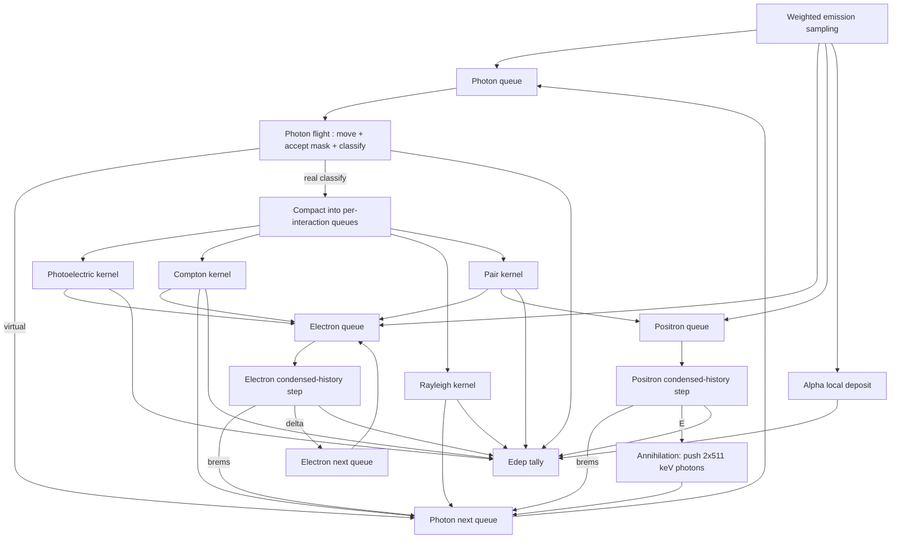

# GPU-Accelerated Direct Monte Carlo Dosimetry in Voxelized Human Phantom (PyTorch-Orchestrated)

## 1. Requirements

### 1.1 Functional requirements
1. **Direct Monte Carlo transport** in a voxelized human body for:
   - **Photons** (γ/X, including 511 keV annihilation photons)
   - **Electrons / positrons**
   - **Alpha particles** (energy deposited locally)
2. Include **secondary and cascaded particles** generated by interactions (no decay daughters):
   - Photon interactions produce **photoelectrons**, **Compton electrons**, **pair e⁻/e⁺**
   - Charged particles produce **bremsstrahlung photons** and **δ-rays**
   - Positrons produce **annihilation photons**
   - Atomic relaxation after photoelectric produces **fluorescence X-rays and Auger electrons** (explicit above cutoff, local below)
3. **Correct energy bookkeeping**: no double counting; energy conservation respected within statistical uncertainty.
4. Support medical radionuclide energy ranges:
   - Photons: **10 keV–3 MeV**
   - e⁻/e⁺: **0.1 keV–3 MeV**
   - α: typically **4–9 MeV** (local deposition at mm voxels)
5. Phantom is a **voxel grid** with voxel size **≥ 2 mm** (can be larger).
6. Use **precomputed physics data** to accelerate sampling.
7. Performance target scenario:
   - Volume: **256×256×1024** with **2 mm** isotropic voxels (≈ 6.71×10⁷ voxels)
   - “1.0×10⁸ decays” should complete **< 1 minute** on **RTX 4090 16 GB**, using MC-correct acceleration (weighted histories and GPU wavefront).

### 1.2 Non-functional requirements (GPU acceleration)
1. Avoid GPU-hostile operations:
   - Per-thread long **unbounded while loops**
   - Heavy **if/else** control flow inside hot kernels
   - Frequent **dynamic memory allocation**
   - Excessive **global atomics** to a few hotspot voxels
   - Rejection sampling loops with variable iterations (warp divergence)
   - Frequent CPU↔GPU synchronization
2. Use GPU-friendly algorithms:
   - **Wavefront / queue-based transport**
   - **Woodcock (delta) tracking** for photons (no boundary stepping)
   - **Table-driven inverse-CDF sampling** (no rejection loops)
   - **Stream compaction** (prefix sum) to remove dead particles and split by event type
   - Optional **sorting by key** (energy bin / material class / Morton code) to improve coherence
3. Make good use of PyTorch:
   - Tensors for all state, tables, and tallies
   - CUDA extensions/Triton kernels for particle transport loops and compaction
   - Use torch streams and asynchronous execution to reduce overhead

---

## 2. Physical model (transport and interactions)

### 2.1 Geometry and materials
- Geometry: Cartesian voxel grid with constant voxel size.
- Each voxel has:
  - `material_id` (integer material index)
  - `density` (g/cm³) optionally (if cross sections use density scaling)
- Minimum material set recommended: air, lung, soft tissue, cortical bone (+ optional marrow).

### 2.2 Photon transport
Interactions modeled:
- Photoelectric absorption
- Compton scattering
- Rayleigh scattering (recommended <~50 keV; optional for speed)
- Pair production (E > 1.022 MeV)

Secondaries:
- Photoelectric → photoelectron + atomic relaxation (fluorescence X-rays / Auger)
- Compton → recoil electron
- Pair → electron + positron (then positron annihilation photons)

### 2.3 Electron/positron transport (condensed history)
The model is MC-correct within established condensed-history assumptions:
- Continuous slowing down for “soft” collisional losses (restricted stopping power)
- Multiple scattering net deflection sampled per step (precomputed angular distribution parameters)
- “Hard” discrete events sampled stochastically above thresholds:
  - Bremsstrahlung photon emission
  - δ-ray emission (knock-on electron)

Positrons:
- Same transport as electrons while slowing down
- At low energy: annihilation at rest producing **two 511 keV photons back-to-back**

### 2.4 Alpha particles (local deposition)
Because α range in tissue is **orders of magnitude smaller** than 2 mm voxels:
- Deposit full **alpha kinetic energy** locally in the source voxel.
- No explicit α transport.
- No hadronic secondaries (not relevant for macroscopic dose at mm scale).

### 2.5 Cutoffs and termination rules
To control step counts and ensure consistent physics:
- Photon cutoff `E_cut_γ` (typical 1–10 keV): below cutoff, deposit remaining photon energy locally and terminate.
- e⁻/e⁺ cutoff `E_cut_e` (typical 1–10 keV): below cutoff, deposit remaining kinetic energy locally and terminate.
- Atomic relaxation products below cutoff deposit locally; above cutoff are transported.

### 2.6 Energy deposition bookkeeping (avoiding double counting)
This is the “audit trail” linking photons → electrons/positrons → deposition:

**Photons deposit energy only via interactions.**  
- No continuous photon dose along flight.

**Compton**
- Create recoil electron with kinetic energy `T = E − E'`.
- Continue photon with `E'`.
- Deposit occurs via electron transport (or local deposit if below cutoff).
- Do not also deposit `T` locally at the Compton site if recoil electron is created.

**Photoelectric**
- Photon disappears.
- Create photoelectron: `T = Eγ − E_binding(shell)`.
- Binding energy carried by fluorescence/Auger cascade or deposited locally (cutoff).
- Do not deposit full `Eγ` locally in addition to creating the electron.

**Pair production**
- Photon disappears.
- Create e⁻ and e⁺ with sampled kinetic energies.
- **Do not deposit 1.022 MeV locally**.
- The 1.022 MeV is carried by the annihilation photons emitted later; transported as photons.

**Brems / δ-ray**
- When emitting a brems photon or δ-ray, subtract the emitted energy from the parent charged particle so it is not deposited twice.

**Positron annihilation**
- Deposit remaining kinetic energy at cutoff.
- Generate two 511 keV photons; their energy deposition is handled by photon transport or escape.

These rules guarantee no systematic double counting.

---

## 3. High-performance GPU transport architecture

## 3.1 Wavefront (queue-based) particle transport
Instead of one-thread-per-particle with long divergent loops, use wavefront cycles:

1. Maintain packed queues (SoA) for photons, electrons, positrons.
2. Each GPU kernel processes one “micro-transport” stage:
   - Photon flight + accept/reject (Woodcock)
   - Photon interaction kernels (split by interaction type)
   - Charged step kernel + event classification
   - Compaction to next queues
3. Repeat until queues are empty or maximum iterations reached.

This keeps kernel work uniform and reduces warp divergence.

---

## 4. GPU acceleration details: algorithms and data structures

This section focuses on **minimizing if/else**, avoiding GPU-hostile operations, and using GPU-native parallel primitives.

### 4.1 Particle state: Structure-of-Arrays (SoA)
SoA ensures coalesced memory access:

- `x[N], y[N], z[N]` float32
- `ux[N], uy[N], uz[N]` float32
- `E[N]` float32
- `w[N]` float32
- `rng_key[N], rng_ctr[N]` uint64 (Philox)

Queues are “packed” arrays—dead particles removed every wavefront via compaction.

### 4.2 RNG (counter-based, divergence-free)
Use Philox/Threefry style RNG:
- No global RNG state
- Deterministic under parallel execution
- Each particle consumes a fixed number of randoms per kernel stage when possible

Avoid GPU-hostile RNG patterns:
- Do not use variable-iteration rejection loops for main sampling paths.

### 4.3 Photon transport: Woodcock (delta tracking) to remove boundary stepping
Boundary stepping is branch-heavy. Woodcock replaces it with:
- one exponential step sample using `Σ_max(Ebin)` (majorant)
- one accept/reject mask: `accept = (u < Σ_t(m,E)/Σ_max(E))`

**Branch-minimized implementation**:
- Compute voxel index and out-of-bounds mask
- Use mask to mark photons dead; compaction removes them
- Accept/reject computed as boolean tensor; virtual collisions handled by writing to “next photon queue”

### 4.4 Interaction selection without deep branching
Compute cumulative probabilities from tables:
- `c0 = p_photo`
- `c1 = c0 + p_compton`
- `c2 = c1 + p_rayleigh`

Select channel index:
- `idx = (u > c0) + (u > c1) + (u > c2)`

Then **avoid divergent per-thread switching** by:
- writing `idx` to a classification array
- **compact photons into 4 per-interaction queues** using prefix sums
- run one specialized kernel per interaction type (no internal branching)

This converts branching into GPU-friendly **mask + prefix sum + scatter**.

### 4.5 Inverse-CDF sampling (no rejection loops)
For Compton scattering and brems/δ-ray spectra:
- Precompute inverse CDF tables.
Sampling:
- `t = u*(K-1)`  
- `i0 = floor(t)`, `f = t - i0`  
- `value = lerp(tab[i0], tab[i0+1], f)`

This costs only arithmetic and global reads.

### 4.6 Charged transport: masks + compaction instead of early exits
Instead of:
- `if (E < cut) break;`
Use:
- compute `alive_mask = (E >= cut)`
- deposit remaining energy for `~alive_mask`
- compact alive particles to next queue

Similarly for brems/δ emission:
- compute `emit_mask = (u < P_event)`
- compact emitters into an “event queue”
- run emission kernel only on emitters

### 4.7 Reduce atomic contention in dose scoring
Atomic adds can bottleneck near sources.

Two-tier approach:
1. **Photon deposition** (less localized): atomicAdd directly.
2. **Electron deposition** (localized): tile-based reduction:
   - compute deposition voxel index per substep
   - sort or bin by tile ID (optional)
   - block accumulates into shared memory tile
   - flush tile with fewer atomics

This avoids GPU-hostile hotspot atomics.

### 4.8 Optional: sorting to improve coherence (used selectively)
Sort particle queues by a key:
- `key = (ebin << a) | (mat_class << b) | morton(voxel)`
Using radix sort (CUB) occasionally can:
- increase cache hit rate on tables
- reduce divergence in material-dependent physics
- improve block-local tallying

Sorting is GPU-expensive; enable only when queue large or highly heterogeneous.

---

## 5. PyTorch usage model (practical and performant)

### 5.1 What PyTorch does best here
- Owns all tensors on GPU (phantom, tables, queues, tallies).
- Launch orchestration:
  - kernel dispatch sequence
  - stream scheduling
  - memory reuse and buffer pooling
- Provides tensor ops for:
  - building emission CDFs
  - computing masks and keys
  - managing high-level scheduling

### 5.2 What must be CUDA/Triton (hot loops)
- Photon flight kernel (Woodcock)
- Interaction kernels
- Electron/positron step kernels (condensed history)
- Compaction / prefix sum (CUB)
- Optional radix sorting (CUB)

### 5.3 Avoiding CPU-GPU sync
- Use CUDA graphs (optional) for repeated wavefront cycles:
  - capture a fixed sequence of kernels
  - replay with updated queue sizes
- Avoid calling `.item()` or any blocking ops inside main loop.

---

## 6. Precomputed data (detailed)

### 6.1 Cross sections and derived probabilities
For each material `m` and energy bin `e`:

- `Σ_photo[m,e]`
- `Σ_compton[m,e]`
- `Σ_rayleigh[m,e]`
- `Σ_pair[m,e]`
- `Σ_total[m,e] = sum`
- `P_cum[m,e,3]` (cumulative for channel selection)

**Woodcock majorant**:
- `Σ_max[e] = max_m Σ_total[m,e]`
Optionally:
- `Σ_max_region[r,e]` (region-wise majorants) to reduce virtual collisions.

### 6.2 Photon kinematics samplers
- Compton inverse CDF for `cosθ` (or energy ratio `E'/E`) per photon energy bin.
- Pair-energy split inverse CDF per energy bin (optional).
- Rayleigh angle sampler (optional).

### 6.3 Atomic relaxation data (optional but recommended)
For each material and shell:
- binding energies
- fluorescence yields
- line energies & probabilities (simplified)
- Auger yields/spectra (simplified)

Implementation strategy:
- Explicitly produce X-ray photons and Auger electrons above cutoffs.
- Below cutoffs deposit locally.

### 6.4 Charged particle transport data
For each material and electron energy bin:
- restricted stopping power `S_r(m,e)`
- CSDA range `R(m,e)`
- multiple scattering parameters (e.g., moments for net deflection)
- integrated hard-event probabilities for chosen step model:
  - `P_brem(m,e,Δs)`
  - `P_delta(m,e,Δs)`
Simplify by using:
- `P_brem_per_cm(m,e)` and `P_delta_per_cm(m,e)` then `P ≈ 1-exp(-λΔs)`.

**Spectral samplers**
- Inverse CDF tables for brems photon energy fraction
- Inverse CDF tables for δ-ray energy

### 6.5 Storage, precision, and memory
- Cross sections/probabilities: float32
- Inverse CDF tables: float16/bfloat16 possible after validation
- Energy bin edges: float32 constant memory
- Material tables: stored in contiguous `[M, Ebin]` arrays for coalesced reads.

---

## 7. Accuracy controls (knobs)

Main accuracy/performance knobs:
1. Energy bin count: 128–512
2. Cutoffs `E_cut_γ`, `E_cut_e`
3. Electron step size controls:
   - `Δs <= f_voxel * voxel_size`
   - `Δs <= f_range * R(E)`
   - `ΔE/E` max fraction per step
4. Atomic relaxation mode: explicit vs local
5. Rayleigh scattering enabled/disabled (low-energy accuracy)

Expected behavior at 2 mm voxels:
- Dose is dominated by energy deposited by electrons; condensed-history is appropriate.
- Atomic relaxation details have limited impact on mm-scale absorbed dose except at very low photon energies or high-Z implants.

---

## 8. Validation plan (medical physics grade)

### 8.1 Unit tests (physics and bookkeeping)
- Energy conservation in homogeneous phantom:
  - emitted energy ≈ deposited + escaped (within MC uncertainty)
- No-double-count checks for Compton/photoelectric/pair scenarios:
  - compare summed energy transfer against expected distributions
- Regression tests for RNG determinism under fixed seeds

### 8.2 Benchmark comparisons (against reference MC)
- Water point source:
  - radial dose profiles for representative nuclide spectra
- Heterogeneity slab:
  - lung/tissue/bone inserts; compare depth-dose or kernel-like profiles vs Geant4/GATE
- Positron:
  - 511 keV photon distribution and dose spread
- Electron:
  - range/energy loss vs ESTAR; brems yields vs reference condensed-history MC

### 8.3 Clinical plausibility checks
- Compare organ mean dose in phantom to published S-values under simplified geometries (sanity check).

---

## 9. Estimated performance for 256×256×1024 @ 2 mm (RTX 4090)

### 9.1 What dominates time
- Photon flight with Woodcock: many steps but cheap (mostly arithmetic + table reads)
- Charged condensed-history: fewer steps but includes tallying and occasional secondary generation
- Queue operations: compaction (prefix sum) and optional sorting
- Dose tally atomics (especially for localized electrons)

### 9.2 Throughput assumptions (engineering estimate)
On an RTX 4090, with optimized CUDA kernels:
- Photon Woodcock “flight+accept” stage: **~1e9 lightweight steps/s** possible if memory-coalesced and divergence minimized.
- Condensed-history charged steps: **~1e8–3e8 steps/s** depending on scoring contention and table reads.
- Compaction overhead: depends on queue size; typically a few ms per large compaction.

### 9.3 Translating 1e8 decays into simulated histories (MC-correct)
To complete in <1 minute, treat “1e8 decays” as **decay-equivalent weight**, not 1e8 explicit tracked primaries:

- Choose `N_sim_decays` = 1–10 million (tunable)
- Assign weight `w = 1e8 / N_sim_decays`
- This is unbiased for expected dose; variance controlled by `N_sim_decays` and VR.

**Typical internal emitter** might yield:
- ~1 photon per decay order and/or β per decay; depends strongly on nuclide.
- With secondaries, total transported particles per simulated decay can be 1–5 on average (highly case-dependent).

### 9.4 Example runtime estimate (order-of-magnitude)
Assume:
- `N_sim_decays = 5e6`
- Average transported particles per decay ≈ 2 (mixed photon + charged; secondaries included)
- Total particle tracks ≈ 1e7
- Average steps:
  - photons: 10 Woodcock steps each (virtual+real)
  - charged: 5 condensed steps each

Total “steps”:
- photon steps ≈ 1e7 * 10 = 1e8
- charged steps ≈ 1e7 * 5 = 5e7
- total ≈ 1.5e8 steps + queue ops

At achievable throughput:
- photon part: ~0.1 s (if very efficient) up to a few seconds (if table/memory bound)
- charged part: ~0.2–1 s up to several seconds (scoring bound)
- queue compaction + interaction kernels + overhead: ~5–30 s depending on implementation maturity and sorting
- dose conversion: <1 s

**Estimated total** (with mature kernels, no heavy sorting): **20–60 seconds**.  
If using frequent sorting or heavy event reduction, runtime may exceed 60 seconds unless carefully tuned.

> If the requirement strictly means “track 1e8 explicit decays (no weighting)”, then <1 minute is not realistic on a single RTX 4090 without unacceptable physics simplifications. The weighted-history approach is unbiased MC and is the standard way to represent large decay counts efficiently.

---

## 10. Expected accuracy and uncertainty

### 10.1 Accuracy sources
- Condensed-history approximations for e⁻/e⁺
- Energy bin interpolation error
- Cutoff handling (local deposition below thresholds)
- Simplified atomic relaxation (if used)
- Voxel resolution limits (2 mm cannot resolve microdosimetry)

### 10.2 Statistical uncertainty
- Controlled by the number of simulated weighted histories and variance reduction.
- For organ mean doses, often **< 1–3%** achievable with millions of histories.
- For voxel-level dose in low-activity regions, uncertainty may be larger.

Provide optional output:
- per-voxel estimated variance via history batching (requires extra memory/time)
- or ROI-based uncertainty by scoring tallies per batch.

---

## 11. End-to-end workflow summary

1. Load phantom tensors (`material_id`, `density`).
2. Load precomputed physics tables to GPU.
3. Build emission samplers for the chosen radionuclide.
4. Sample **weighted** decay sites and primary emissions into initial queues.
5. Iterate wavefront transport:
   - photon flight → classify → interaction kernels
   - charged steps → classify hard events → emission kernels
   - annihilation kernel for positrons at cutoff
   - compaction each cycle
6. Convert `Edep` to **Gy** using per-voxel mass; compute ROI statistics.
7. Validate: energy conservation + reference comparisons.

---

## 12. Deliverables
- GPU-resident physics table format and loader
- CUDA/Triton kernels:
  - photon woodcock flight+accept
  - photon interaction kernels
  - electron and positron step kernels
  - annihilation kernel
  - queue compaction (prefix sum)
  - optional sorting/tile tallying kernels
- PyTorch orchestrator with:
  - buffer pooling
  - async launches + optional CUDA graph capture
  - reproducible RNG management
- Validation suite with reference cases and energy conservation tests

---

## 13. Conclusion: estimated time, accuracy, and validation steps

### Estimated time (256×256×1024 @ 2 mm, RTX 4090)
- With **unbiased weighted-history sampling**, optimized wavefront kernels, Woodcock photons, and condensed-history charged transport:
  - **Expected**: **~20–60 seconds** for a “1e8 decay-equivalent” case (nuclide-dependent).
- If strictly simulating **1e8 explicit decays**, runtime will exceed 1 minute on a single 4090 in most realistic physics settings.

### Expected accuracy
- Macroscopic absorbed dose (Gy) at 2 mm voxel: good clinical dosimetry fidelity.
- Absolute agreement to reference MC typically within:
  - **few percent** in homogeneous regions (after tuning cutoffs and bins)
  - potentially larger near strong heterogeneities depending on step-size controls and material set

### Validation steps (must be completed)
1. Energy conservation tests (deposit + escape ≈ emitted).
2. Homogeneous water benchmarks vs Geant4/GATE for representative energies and spectra.
3. Heterogeneity benchmarks (lung/bone inserts).
4. Electron transport benchmarks vs EGSnrc/ESTAR (range and brems yields).
5. Positron annihilation spatial test vs reference MC.
6. Regression tests for deterministic RNG, stability across GPU driver versions.

---