# Particle Interaction Cascades for Human Tissue

This document contains Mermaid flowcharts describing particle interactions and cascaded particles in human body tissue for different medical applications.

---

## Chart 1: General Medical Applications (10 keV - 25 MeV)

**Context:** External Beam Radiotherapy (Linacs), Diagnostic Imaging (CT, Mammography, PET), Radiation Protection

```mermaid
graph LR
    %% Primary Particles
    subgraph P["Primary Particles"]
        P1[Photon γ<br/>Ext Beam]
        P2[Electron e⁻<br/>Linac]
        P3[Positron e⁺<br/>PET]
    end

    %% Interactions
    subgraph I["Interactions"]
        I1[Photoelectric<br/><30 keV]
        I2[Compton<br/>0.1-25 MeV<br/>★ Dominant]
        I3[Pair Prod<br/>>10 MeV]
        I4[Rayleigh<br/>No dose]
        I5[Photonuclear<br/><1%]
        I6[Inelastic<br/>Primary dose]
        I7[Bremsstrahlung<br/><1%]
        I8[Cerenkov<br/>No dose]
        I9[Annihilation<br/>511 keV]
    end

    %% Secondary Particles
    subgraph S["Secondary Particles"]
        S1[Photoelectron e⁻]
        S2[Compton e⁻]
        S3[e⁻ & e⁺]
        S4[n & p⁺]
        S5[Delta Rays]
        S6[Brems γ]
        S7[Cerenkov γ]
        S8[Scattered γ]
        S9[511 keV γ]
    end

    %% Cascaded Particles
    subgraph C["Cascaded Particles"]
        C1[Auger e⁻]
        C2[Char X-rays]
        C3[Annihilation γ]
        C4[Brems 2nd]
        C5[Delta 2nd]
        C6[Isotopes]
        C7[β/γ decay]
        C8[Heat]
    end

    %% Dose
    subgraph D["Dose Deposition"]
        D1[Local<br/>Photoelectric]
        D2[Depth<br/>Compton]
        D3[Deep<br/>Pair Prod]
        D4[Primary<br/>Inelastic]
        D5[Minimal<br/>Brems]
        D6[None<br/>Cerenkov]
    end

    %% Connections
    P1 --> I1 & I2 & I3 & I4 & I5
    P2 --> I6 & I7 & I8
    P3 --> I9

    I1 --> S1
    I2 --> S2 & S8
    I3 --> S3
    I5 --> S4
    I6 --> S5
    I7 --> S6
    I8 --> S7
    I9 --> S9

    S1 --> C1 & C2 & C4
    S2 --> C5 & C4
    S3 --> C3 & C4
    S4 --> C6
    S6 --> C1 & C2
    S9 --> C1 & C2
    S5 --> C8

    I1 --> D1
    I2 --> D2
    I3 --> D3
    I6 --> D4
    I7 --> D5
    I8 --> D6

    %% Styling
    classDef p fill:#e1f5ff,stroke:#01579b,stroke-width:2px
    classDef i fill:#fff9c4,stroke:#f57f17,stroke-width:2px
    classDef s fill:#e8f5e9,stroke:#1b5e20,stroke-width:2px
    classDef c fill:#f3e5f5,stroke:#4a148c,stroke-width:2px
    classDef d fill:#ffebee,stroke:#b71c1c,stroke-width:2px

    class P1,P2,P3 p
    class I1,I2,I3,I4,I5,I6,I7,I8,I9 i
    class S1,S2,S3,S4,S5,S6,S7,S8,S9 s
    class C1,C2,C3,C4,C5,C6,C7,C8 c
    class D1,D2,D3,D4,D5,D6 d
```

---

## Chart 2: Radionuclide Pharmacy Therapy (RPT) (10 keV - 10 MeV)

**Context:** Targeted Alpha Therapy (TAT), Beta-emitters (Lu-177, Y-90), Theranostics, Internal Dosimetry

```mermaid
graph LR
    %% Primary Particles
    subgraph P["Primary Decay Particles"]
        P1[γ<br/>I-131/Lu-177]
        P2[β⁻<br/>Y-90/Lu-177]
        P3[α<br/>Ac-225/Ra-223]
        P4[Auger e⁻<br/>EC/IC]
        P5[e⁺<br/>PET]
    end

    %% Interactions
    subgraph I["Interactions"]
        I1[Photoelectric<br/>Imaging]
        I2[Compton<br/>Cross-fire]
        I3[Inelastic<br/>Cross-fire<br/>mm-cm]
        I4[Brems<br/>Surrogate]
        I5[α Coulomb<br/>High LET<br/>40-80μm]
        I6[Nuclear Recoil<br/>Daughter]
        I7[Auger/C-K<br/>Nanodosimetry]
        I8[Shake-off<br/>Extra e⁻]
        I9[Annihilation<br/>Standard]
        I10[Positronium<br/>2γ/3γ]
    end

    %% Secondary Particles
    subgraph S["Secondary Particles"]
        S1[Photoelectron e⁻]
        S2[Compton e⁻]
        S3[Scattered γ]
        S4[Delta Rays<br/>High density]
        S5[Brems X-rays]
        S6[Auger Shower<br/>5-20 e⁻]
        S7[Shake-off e⁻]
        S8[511 keV γ]
        S9[Ionized Daughter<br/>~100 keV]
    end

    %% Cascaded Particles
    subgraph C["Cascaded Particles"]
        C1[Vacancy Cascade]
        C2[Coulomb Expl<br/>Nanodosimetry]
        C3[DS DNA<br/>Breaks]
        C4[ROS]
        C5[Local Spike]
        C6[Bond Rupture]
        C7[Free Radicals]
        C8[Ionized Bio]
        C9[UV/Vis γ]
    end

    %% Biological Effects
    subgraph B["Biological Effects"]
        B1[Self-Dose<br/>RBE 3-7+<br/>nm]
        B2[Cross-Fire<br/>mm-cm]
        B3[High RBE<br/>1-2 hits]
        B4[Overcomes<br/>Hypoxia]
        B5[Daughter<br/>Migration]
        B6[Micro<br/>Confined]
    end

    %% Connections
    P1 --> I1 & I2
    P2 --> I3 & I4
    P3 --> I5 & I6
    P4 --> I7 & I8
    P5 --> I9 & I10

    I1 --> S1
    I2 --> S2 & S3
    I3 --> S4
    I4 --> S5
    I5 --> S4
    I6 --> S9
    I7 --> S6
    I8 --> S7
    I9 --> S8
    I10 --> S8

    S1 --> C1 & C2
    S2 --> C3 & C4
    S3 --> S1
    S4 --> C3 & C4
    S5 --> S1
    S6 --> C1 & C2
    S7 --> C3 & C4
    S8 --> S1
    S9 --> C5 & C6

    S6 --> B1
    C2 --> B1
    S4 --> B2
    C3 --> B3
    C4 --> B3
    S9 --> B5
    I5 --> B3 & B4 & B6

    %% Styling
    classDef p fill:#e1f5ff,stroke:#01579b,stroke-width:2px
    classDef i fill:#fff9c4,stroke:#f57f17,stroke-width:2px
    classDef s fill:#e8f5e9,stroke:#1b5e20,stroke-width:2px
    classDef c fill:#f3e5f5,stroke:#4a148c,stroke-width:2px
    classDef b fill:#ffebee,stroke:#b71c1c,stroke-width:2px

    class P1,P2,P3,P4,P5 p
    class I1,I2,I3,I4,I5,I6,I7,I8,I9,I10 i
    class S1,S2,S3,S4,S5,S6,S7,S8,S9 s
    class C1,C2,C3,C4,C5,C6,C7,C8,C9 c
    class B1,B2,B3,B4,B5,B6 b
```

---

## Summary of Key Differences

### General Medical Applications (10 keV - 25 MeV)
- **Primary Sources:** External beams (photons, electrons), PET positrons
- **Dominant Interactions:** Compton scattering (therapy), Photoelectric (diagnostics)
- **Key Features:**
  - External beam delivery
  - Higher energy range (up to 25 MeV)
  - Photonuclear interactions (>10 MeV)
  - Cerenkov radiation visible
  - Pair production (>10 MeV)

### Radionuclide Pharmacy Therapy (10 keV - 10 MeV)
- **Primary Sources:** Internal radionuclide decay (γ, β, α, auger, e⁺)
- **Dominant Interactions:** Inelastic collisions (β), Inelastic Coulomb (α), Auger cascades
- **Key Features:**
  - Internal source distribution
  - Lower max energy (10 MeV)
  - α: High LET, 40-80 μm track
  - Auger: Nanodosimetry
  - Nuclear recoil & daughter redistribution
  - Cross-fire effects from β
  - Coulomb explosions

---

## Legend

| Color | Meaning |
|-------|---------|
| 🔵 Blue | Primary particles |
| 🟡 Yellow | Interaction mechanisms |
| 🟢 Green | Secondary particles |
| 🟣 Purple | Cascaded particles |
| 🔴 Red | Biological effects/dose |

---

## Energy Ranges

| Application | Particle | Energy Range |
|-------------|----------|--------------|
| General | Photon | 10 keV - 25 MeV |
| General | Electron | 0 - 25 MeV |
| General | Positron | 0 - 2 MeV |
| RPT | Gamma | 10 keV - 10 MeV |
| RPT | Beta | 10 keV - 2.3 MeV |
| RPT | Alpha | 4 - 9 MeV |
| RPT | Auger | < 1 keV |
| RPT | Positron | 0 - 2 MeV |
