# Physics for Radionuclide Pharmacy Dosimetry (RPT) 

This document is a unified, comprehensive, physics-correct design reference for **internal dosimetry** of **radiopharmaceuticals injected into the human body**, targeting **mm‑scale voxel absorbed dose** using **Monte Carlo (MC) particle transport**. It combines all content and diagrams from the attached **physics.md** and **physics_rpt.md**, and organizes them into a single consistent model that covers:

- separation of radioactive daughters and decay chains  
- primary particle generation from nuclear decay  
- secondary and cascaded particles created during transport and atomic relaxation  
- transport and interactions in human tissues in the **10 keV to 3 MeV** regime  
- CT HU → density → material composition → cross sections and stopping powers  
- energy deposition, absorbed dose, uncertainties, and cutoff rules  
- GPU-oriented wavefront transport execution concepts  

> **Scope**: voxel dosimetry (mm-scale) with absorbed dose (Gy) per voxel and uncertainty.  
> **Energy focus**: photons and electrons/positrons in **10 keV to 3 MeV**.  
> **Local deposition regime**: α particles and many low-energy Auger electrons deposit energy over distances far smaller than mm voxels and are treated as local deposition unless explicitly required.

---

## Table of Contents

0. [Modeling Split, Conservation, and Consistency Rules](#0-modeling-split-conservation-and-consistency-rules)  
1. [End-to-End Dosimetry Pipeline: Imaging to Absorbed Dose](#1-end-to-end-dosimetry-pipeline-imaging-to-absorbed-dose)  
2. [Overview: Decay to Dose (Unified Flow)](#2-overview-decay-to-dose-unified-flow)  
3. [Daughter Nuclides and Chains: Separation of Daughters](#3-daughter-nuclides-and-chains-separation-of-daughters)  
4. [Decay and Source-Term Physics (Primary Particle Generation)](#4-decay-and-source-term-physics-primary-particle-generation)  
5. [Source Sampling (MC Initialization)](#5-source-sampling-mc-initialization)  
6. [Primary Particle Transport: What Is Tracked and Where Energy Deposits](#6-primary-particle-transport-what-is-tracked-and-where-energy-deposits)  
7. [Transport and Interactions in Human Tissue](#7-transport-and-interactions-in-human-tissue)  
8. [Atomic Relaxation Cascades: X-rays and Auger Electrons](#8-atomic-relaxation-cascades-x-rays-and-auger-electrons)  
9. [Energy Range and Electron Range in Water (10 keV to 3 MeV)](#9-energy-range-and-electron-range-in-water-10-kev-to-3-mev)  
10. [CT HU to Materials: Composition, Cross Sections, and Stopping Powers](#10-ct-hu-to-materials-composition-cross-sections-and-stopping-powers)  
11. [Energy Deposition, Dose, and Uncertainty](#11-energy-deposition-dose-and-uncertainty)  
12. [Cutoffs and Range Rejection (Energy Conserving)](#12-cutoffs-and-range-rejection-energy-conserving)  
13. [GPU-Oriented Wavefront Transport](#13-gpu-oriented-wavefront-transport)  
14. [Pre-Computed Physics Data Dependencies](#14-pre-computed-physics-data-dependencies)  
15. [Physics Correctness Checklist (Validation Gates)](#15-physics-correctness-checklist-validation-gates)

---

## 0. Modeling Split, Conservation, and Consistency Rules

Internal dosimetry requires two separate physics domains to avoid double counting and preserve energy.

### 0.1 Domain A — Decay / Source-Term Physics (Primary Particle Generation)

Determines **what is emitted at the decay site**:

- decay modes and branching ratios  
- emission yields (intensity per parent decay)  
- energies (discrete lines and continuous spectra)  
- emission directions (usually isotropic)  
- atomic vacancies created by **electron capture (EC)** and **internal conversion (IC)**  
- radioactive daughter creation and chain progression  

### 0.2 Domain B — Transport / Interaction Physics (Propagation in Tissue)

Determines **how emitted particles propagate and deposit energy**:

- photon interactions (photoelectric, Compton, Rayleigh, pair production)  
- electron/positron transport (continuous energy loss + discrete hard events)  
- bremsstrahlung and delta rays  
- positron annihilation  
- atomic relaxation cascades due to vacancies  
- energy deposition accumulation in a voxel grid  

### 0.3 Non-negotiable consistency rules (physics correctness)

- **Neutrinos are non-depositing**: do not score neutrino energy in tissue.  
- **β+ annihilation**: do not inject annihilation photons at the decay site if positron annihilation is simulated during transport (recommended).  
- **Internal conversion**: do not apply ICC twice. Use either:  
  - γ line intensities + ICC-derived conversion electrons, or  
  - explicit conversion electrons with γ intensities already reduced.  
- **Atomic relaxation energy**: if X-rays or Auger electrons are not explicitly tracked, deposit the corresponding energy locally so total energy is conserved.  
- **Cutoff termination**: when a particle is stopped by cutoff, deposit the remaining kinetic energy locally.  

---

## 1. End-to-End Dosimetry Pipeline: Imaging to Absorbed Dose

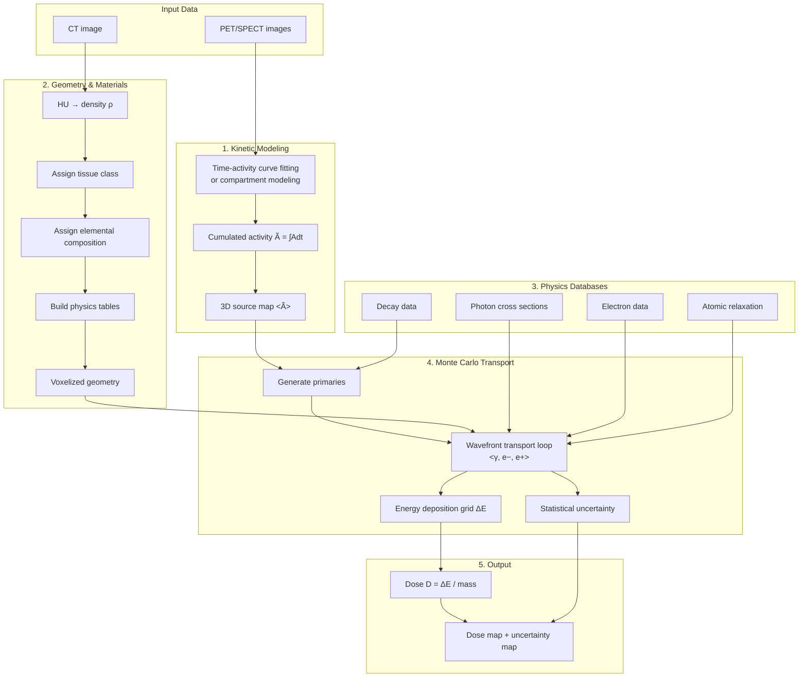

---

## 2. Overview: Decay to Dose (Unified Flow)

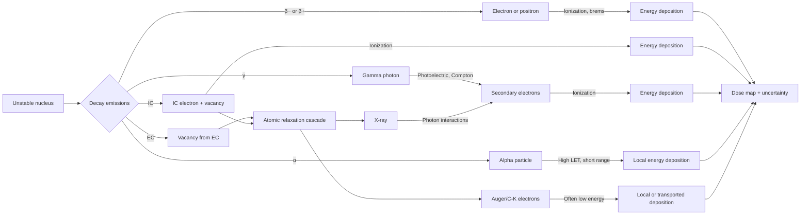

---

## 3. Daughter Nuclides and Chains: Separation of Daughters

Many therapeutic radionuclides produce radioactive daughters that can contribute substantially to absorbed dose. Correct handling requires separating:

- **where and when** daughter decays occur (biokinetics + half-life)  
- **what** emissions occur at daughter decay sites (decay library and sampling)  
- **how** those emissions deposit energy (transport)  

### 3.1 Daughter decay characteristics (examples)

| Parent | Daughter | Daughter decay mode | Key daughter emissions |
|---|---|---|---|
| Ac-225 | Fr-221 | α | 6.3 MeV α |
| Ac-225 | At-217 | α | 7.1 MeV α |
| Ac-225 | Bi-213 | β− (98%), α (2%) | β−, 440 keV γ |
| Ra-223 | Rn-219 | α | 6.8 MeV α |
| Pb-212 | Bi-212 | β− (64%), α (36%) | β−, α, γ |
| Sr-82 | Rb-82 | β+ (95%) | annihilation photons via β+ |

### 3.2 Biokinetics and redistribution considerations

Daughters can have different biological behavior:

- different chemical properties (different Z) affect uptake/clearance  
- recoil and chemical bond breakage can free daughters  
- redistribution can shift dose to different organs  

Effective half-life:

\[
T_{\mathrm{eff}}=\frac{T_{\mathrm{phys}}\,T_{\mathrm{bio}}}{T_{\mathrm{phys}}+T_{\mathrm{bio}}}
\]

### 3.3 Strategy selection chart

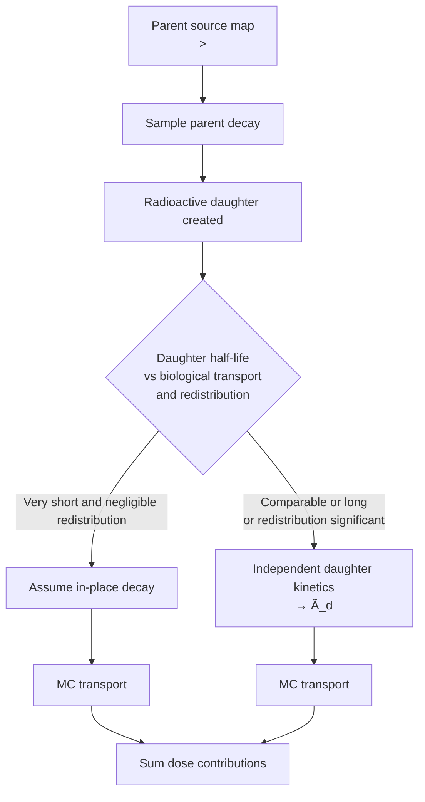

Total dose:

$$D_{\mathrm{total}}(\mathbf{r}) = D_{\mathrm{parent}}(\mathbf{r}) + \sum_i D_{\mathrm{daughter},i}(\mathbf{r})$$

---

## 4. Decay and Source-Term Physics (Primary Particle Generation)

### 4.1 Decay modes (physics-correct summary)

- **β−**: emits e− with continuous spectrum + antineutrino (non-depositing)  
- **β+**: emits e+ with continuous spectrum + neutrino (non-depositing)  
- **EC**: captures inner electron, emits neutrino (non-depositing), creates vacancy  
- **α**: emits helium nucleus with discrete energy, very short range in tissue  
- **IT**: nuclear de-excitation emitting γ and/or IC electron  
- **γ**: discrete photons from nuclear de-excitation  

### 4.2 Primary particle generation chart (decay sampling)

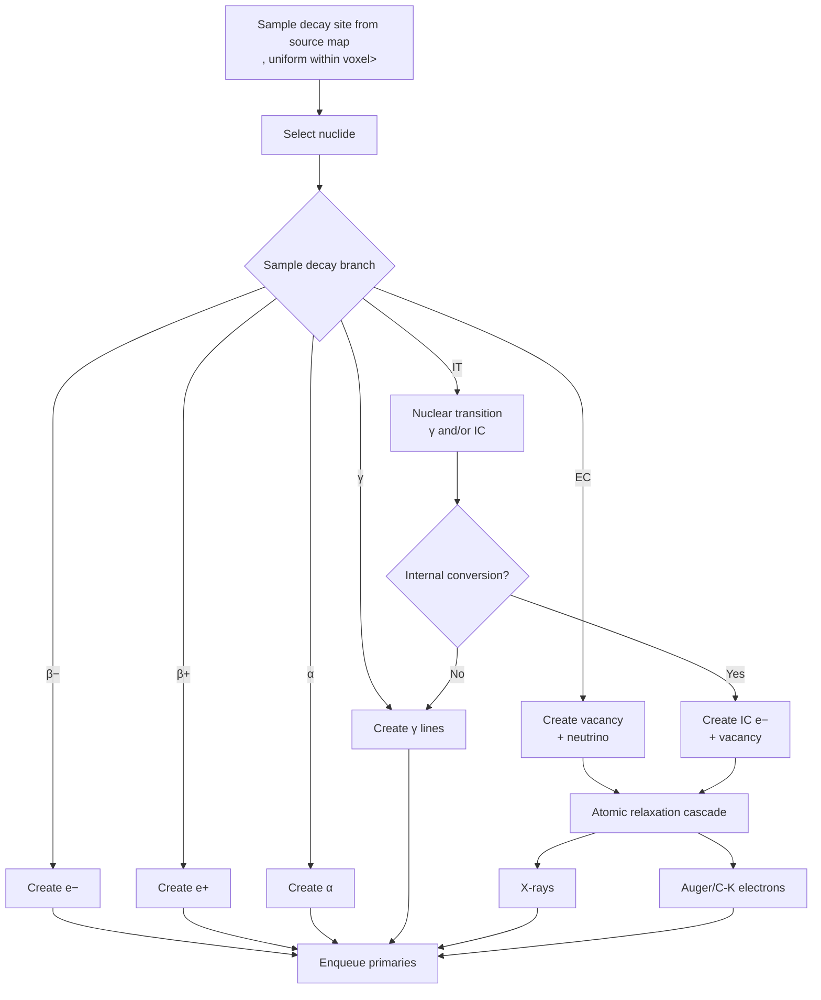

### 4.3 Continuous β spectra sampling (β− and β+)

β spectra are continuous up to endpoint \(E_{\max}\). Correct sampling requires:

- branch sampling by intensity  
- energy sampling from branch-specific CDF derived from appropriate spectral shapes  
- consistent yield convention (per parent decay)  

### 4.4 Internal conversion (IC)

- Competes with γ emission during IT  
- Produces a discrete-energy conversion electron and a vacancy  
- Must be represented once (ICC-derived or explicit library representation)  

### 4.5 Summary table: decay emissions

| Decay mode | Primary particle(s) | Secondary emissions | Notes |
|---|---|---|---|
| β− | e− (continuous) | often γ from daughter | antineutrino non-depositing |
| β+ | e+ (continuous) | annihilation photons via transport | neutrino non-depositing |
| EC | none (neutrino only) | X-rays + Auger e−, often γ | vacancy triggers cascade |
| α | α (discrete) | often γ from daughter | range ≪ mm, local deposition |
| IT | γ and/or IC e− | X-rays + Auger if IC | avoid ICC double count |
| γ | photon (discrete) | none directly | creates secondaries in tissue |

### 4.6 Common radionuclides (examples)

| Radionuclide | Half-life | Modes (illustrative) | Key emissions | Application |
|---|---:|---|---|---|
| F-18 | 109.7 min | β+ dominant, EC minor | β+ + annihilation photons | PET |
| Ga-68 | 67.7 min | β+ dominant | β+ + annihilation photons | PET |
| Cu-64 | 12.7 h | β+, β−, EC | mixed | PET/therapy |
| Zr-89 | 78.4 h | EC dominant, β+ | β+ + 909 keV γ | immuno-PET |
| Tc-99m | 6.0 h | IT | 140 keV γ + IC e− | SPECT |
| Y-90 | 64.1 h | β− | endpoint 2.28 MeV | therapy |
| Lu-177 | 6.65 d | β− | β− + 113/208 keV γ | therapy |
| Tb-161 | 6.9 d | β− | β− + Auger/IC e− | therapy |
| I-131 | 8.02 d | β− | β− + 364 keV γ | therapy/SPECT |
| Ac-225 | 10.0 d | α chain | multiple α + daughters | alpha therapy |

---

## 5. Source Sampling (MC Initialization)

Per simulated history:

1. select nuclide (if multiple)  
2. sample voxel proportional to activity or cumulated activity à 
3. sample position uniformly within voxel  
4. sample decay branch by branching ratios  
5. sample emissions:  
   - discrete: γ, α, IC e−, X-rays, Auger e−  
   - continuous: β spectra from CDF  
6. sample direction isotropically (4π) unless anisotropy is modeled  
7. enqueue particles for transport  

---

## 6. Primary Particle Transport: What Is Tracked and Where Energy Deposits

### 6.1 Primary transport overview

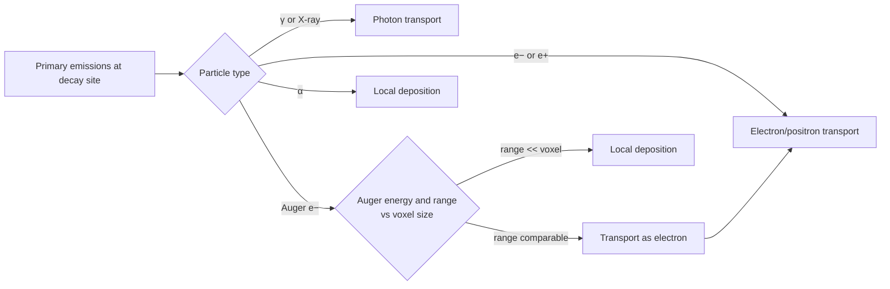

---

## 7. Transport and Interactions in Human Tissue

Transport simulates how primaries create secondaries and deposit energy. Particle creation during transport includes:

- **secondary electrons** (photoelectrons, Compton recoil, delta rays)  
- **secondary photons** (bremsstrahlung, annihilation photons)  
- **cascaded emissions** via atomic relaxation (X-rays, Auger electrons)  

### 7.1 Photon transport and interactions

Photons interact primarily by transferring energy to electrons.

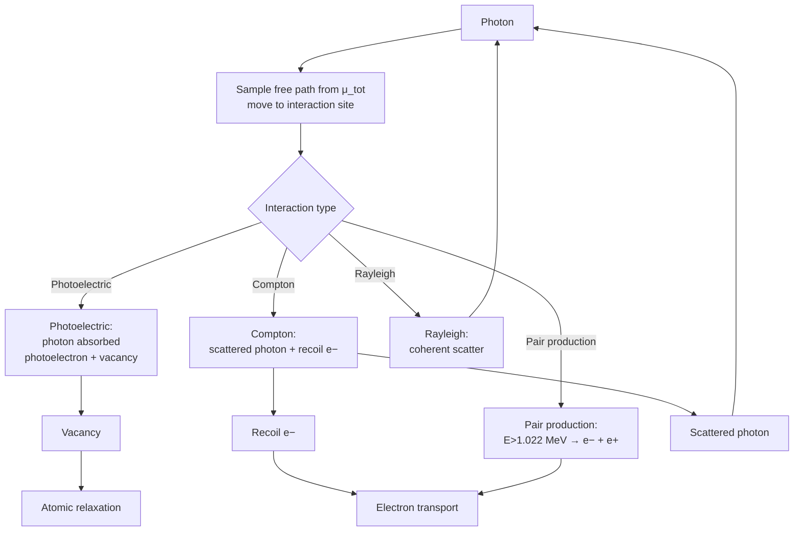

Physics correctness:

- photoelectric creates vacancy; binding energy released by relaxation  
- Compton follows Klein–Nishina; energy-angle coupling preserved  
- pair production requires \(E_\gamma>1.022\) MeV  

### 7.2 Electron and positron transport (condensed history)

Charged particles undergo many small collisions; condensed history groups them into steps.

- **continuous slowing down** using stopping power tables (collision + radiative components)  
- **hard collisions** modeled explicitly:  
  - electrons: Møller scattering (delta rays)  
  - positrons: Bhabha scattering  
- **bremsstrahlung** photons created explicitly for radiative losses  
- **multiple scattering** sampled per step using established models  
- **positron annihilation** occurs primarily at rest:  
  - two ~511 keV photons emitted approximately back-to-back  
  - in-flight annihilation yields Doppler-broadened energies and non-180° angle  

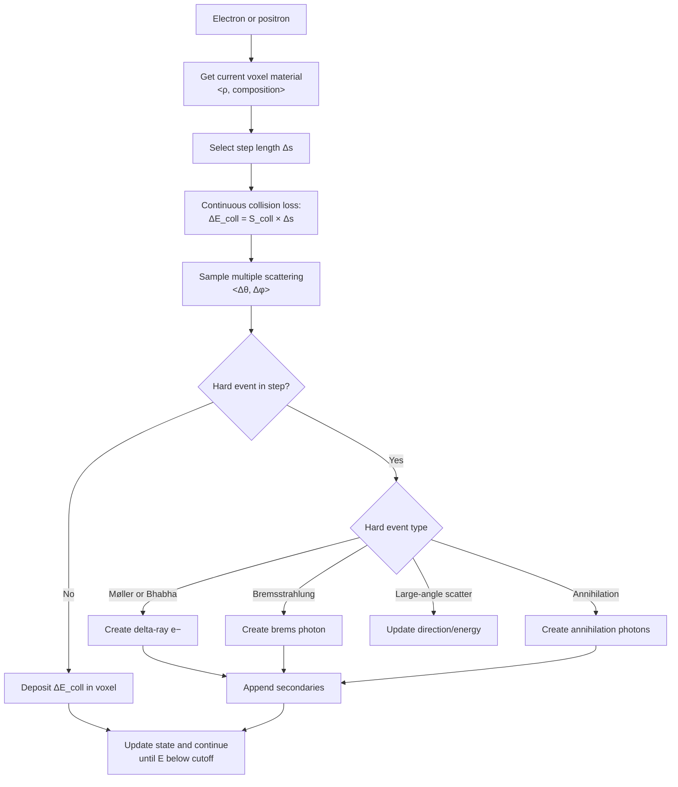

### 7.3 Alpha particles (mm voxels)

α ranges in tissue are typically (< ~100 μm). In mm voxel dosimetry:

- treat α energy as local deposition at the emission voxel  
- explicit α tracking is only needed when spatial resolution approaches range scale  

---

## 8. Atomic Relaxation Cascades: X-rays and Auger Electrons

Atomic relaxation is triggered by:

- EC at decay  
- IC at decay  
- photoelectric interaction in transport  

### 8.1 Cascade generation chart

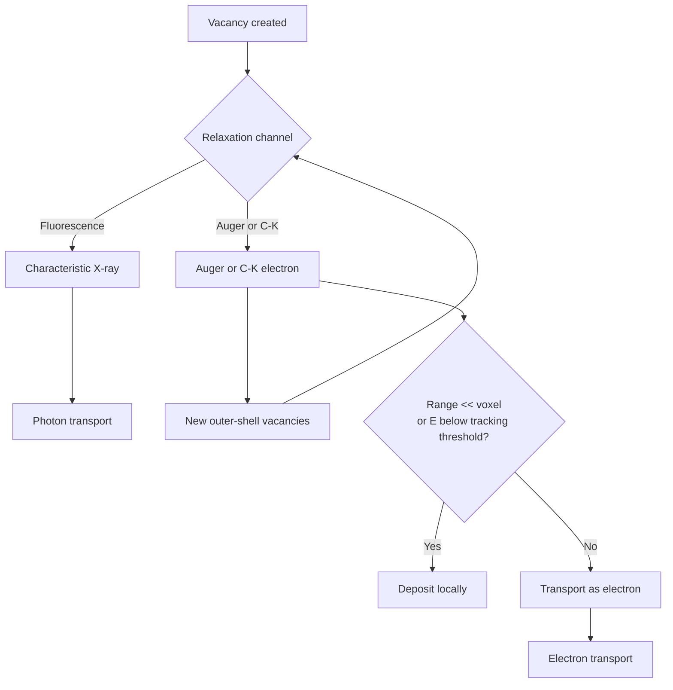

### 8.2 Why local deposition is applicable for many Auger electrons

For mm voxels, local deposition is justified because:

- many Auger electrons have eV–keV energies, giving micrometer-scale ranges in water-equivalent tissue  
- micrometer ranges are far smaller than 1–4 mm voxels  
- explicit transport of sub-voxel-range electrons does not change voxel-level spatial dose distribution  

**Energy conservation requirement**:

- if Auger electrons are not transported, deposit their kinetic energy locally at creation voxel  
- if the cascade is truncated, deposit remaining cascade energy locally  

---

## 9. Energy Range and Electron Range in Water (10 keV to 3 MeV)

The medical radionuclide regime involves:

- photons: ~10 keV X-rays to ~MeV γ  
- electrons: β−, IC electrons, Auger electrons up to a few MeV  

### 9.1 Electron CSDA ranges in water (reference)

| Energy (keV) | CSDA range (mm) |
|---:|---:|
| 10 | 0.0025 |
| 20 | 0.0089 |
| 50 | 0.043 |
| 100 | 0.14 |
| 200 | 0.45 |
| 300 | 0.85 |
| 400 | 1.3 |
| 500 | 1.8 |
| 600 | 2.4 |
| 800 | 3.5 |
| 1000 | 4.4 |
| 1500 | 6.7 |
| 2000 | 9.8 |
| 2280 | 11.0 |

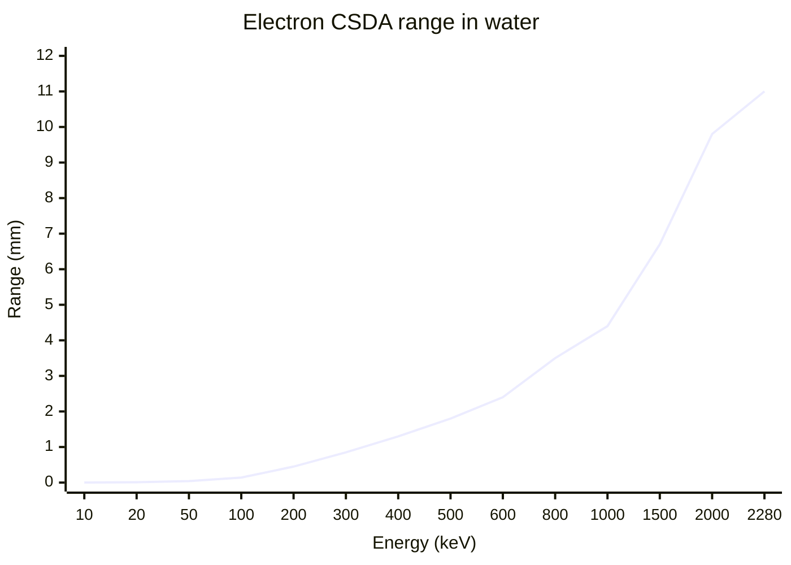

Voxel implications (2 mm example):

- ~100 keV e− range (~0.14 mm) is sub-voxel  
- ~500 keV e− range (~1.8 mm) is near voxel scale  
- ~2 MeV e− range (~1 cm) spans many voxels  

---

## 10. CT HU to Materials: Composition, Cross Sections, and Stopping Powers

Voxel dosimetry depends on correct material modeling.

### 10.1 HU mapping and table construction

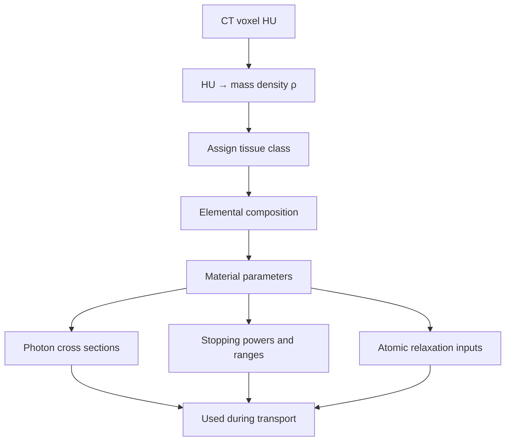

### 10.2 Required physics data products per material

- photon attenuation and differential interaction probabilities  
- electron stopping powers (collision and radiative)  
- multiple scattering model parameters  
- bremsstrahlung emission data  
- atomic relaxation data for vacancy cascades  

---

## 11. Energy Deposition, Dose, and Uncertainty

### 11.1 Energy deposition sources

ΔE per voxel accumulates from:

- continuous charged-particle energy loss along steps  
- discrete hard events (delta rays, photoelectrons)  
- deposited residual energy at cutoffs  
- local deposition components (α, low-energy Auger, truncated cascades)  

### 11.2 Dose equation

For voxel <i,j,k>:

$$
D_{ijk}=\frac{\sum \Delta E_{ijk}}{\rho_{ijk}\,V_{ijk}}
$$

Unit conversion:

$$
1\ \text{keV} = 1.602176634\times 10^{-16}\ \text{J}
\quad,\quad
1\ \text{Gy} = 1\ \text{J}/\text{kg}
$$

### 11.3 Scaling with cumulated activity

If MC produces dose per decay:

\[
D(\mathbf{r}) = D_{\text{per decay}}(\mathbf{r}) \times \tilde{A}(\mathbf{r})
\]

where:

\[
\tilde{A}(\mathbf{r}) = \int A(\mathbf{r},t)\,dt
\]

and (Bq·s equals disintegrations).

### 11.4 Statistical uncertainty

Report uncertainty per voxel using standard MC estimators:

- history-by-history variance estimators, or  
- batch estimators with independent batches  

---

## 12. Cutoffs and Range Rejection (Energy Conserving)

Cutoffs accelerate computation; they must preserve energy.

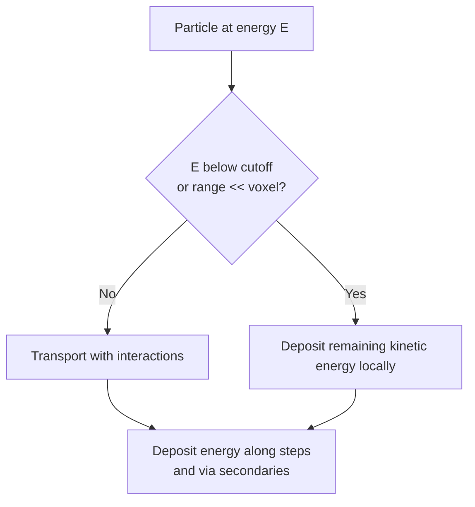

Typical mm voxel choices (2 mm example):

- electron cutoff ~50–100 keV  
- photon cutoff ~1–5 keV  
- α deposited locally  

Rule: stopping a particle deposits the remaining kinetic energy locally, and any untracked cascade energy is also deposited locally.

---

## 13. GPU-Oriented Wavefront Transport

Stack-based tracking can cause thread divergence on GPUs. A wavefront approach improves throughput by batching similar particle states.

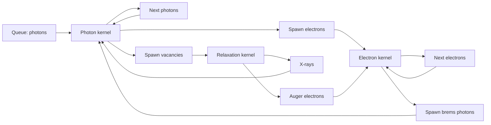

### 13.1 Transport & Interaction (propagation diagram)

This diagram details the propagation and interaction of the primary particles (generated above) within the tissue.

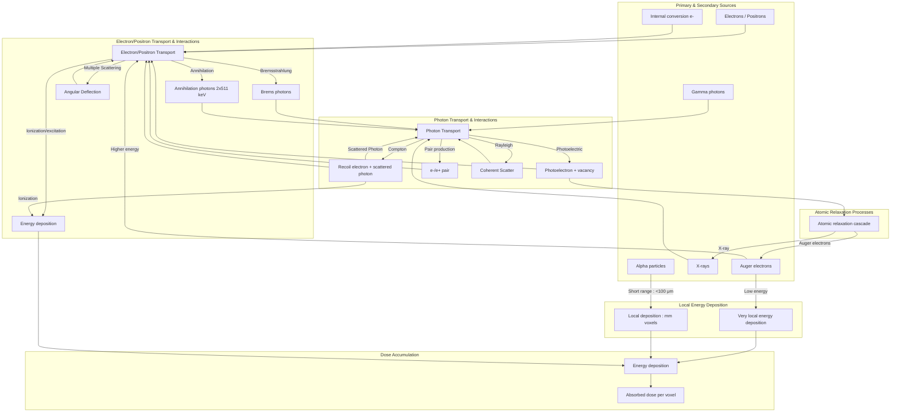

---

## 14. Pre-Computed Physics Data Dependencies

| Data category | Typical sources | Description |
|---|---|---|
| Decay data | ICRP-107, ENSDF, MIRD | half-lives, branching, discrete lines, β spectra |
| Photon cross sections | XCOM, EPDL | photoelectric, Compton, Rayleigh, pair production |
| Electron data | ESTAR, EEDL | stopping powers, ranges, hard-event data |
| Bremsstrahlung | Seltzer–Berger | differential brems emission spectra |
| Atomic relaxation | EADL | fluorescence yields, Auger energies and probabilities |
| Tissue compositions | ICRU-44, ICRP-110 | elemental compositions and densities |

---

## 15. Physics Correctness Checklist (Validation Gates)

1. branching fractions per nuclide sum to 1 within tolerance  
2. yield definitions are explicit (prefer per parent decay)  
3. β spectra sampling uses correct endpoints and intensities and appropriate shapes  
4. neutrinos are excluded from deposition  
5. IC is represented once (ICC-derived or explicit electrons)  
6. vacancies always produce relaxation emissions or equivalent local deposition  
7. β+ annihilation is handled consistently (prevent duplication of 511 keV photons)  
8. cutoff termination conserves energy (deposit remainder locally)  
9. α and most Auger local deposition assumptions align with voxel size goals  
10. HU → density → composition mapping is consistent with cross sections and stopping powers used by transport  